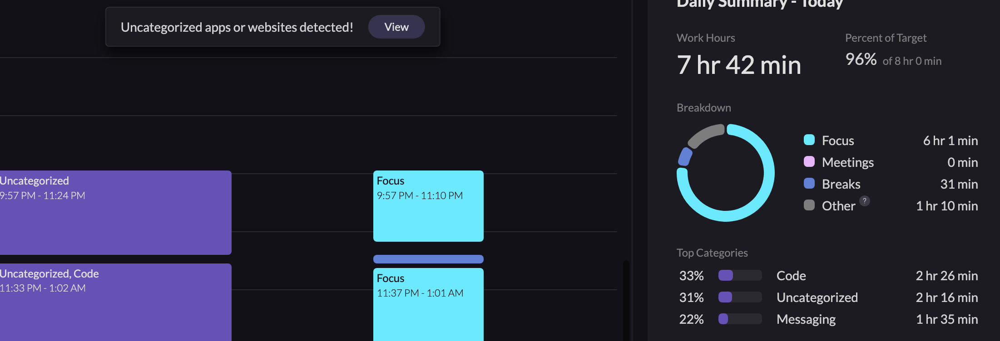

# TIL

## 날짜: 2024-07-09

### 스크럼

- 학습 목표 1 : 사이드플젝 이슈 해결
- 학습 목표 2 : 엘리스 코테 문제 풀기

### 새로 배운 내용

#### 주제 1: 배포한 프론트 서버에서 백엔드에서 설정한 httponly 쿠키유무를 체크하고 싶다면?

쿠키 도메인에 동일한 서브도메인을 명시해야 합니다. 명시하지 않으면, 쿠키를 발급하는 백엔드 주소와 동일하지 않은 모든 사이트에서 접근이 불가능합니다. 이는 응답을 보내는 페이지에 쿠키 저장은 가능하지만 접근 자체는 불가능하다는 것을 의미합니다.
추가코드 : `domain: '.murakano.site',`

```javascript
switch (process.env.NODE_ENV) {
  case "production":
    conf.cookieInAccessTokenOptions = {
      httpOnly: false,
      maxAge: 10 * 60 * 1000,
      sameSite: "Lax",
      domain: ".murakano.site",
      secure: true,
    };
    conf.cookieInRefreshTokenOptions = {
      httpOnly: true,
      maxAge: 12 * 60 * 60 * 1000,
      sameSite: "Lax",
      secure: true,
    };
    conf.envMode = "prod";
    break;
}
```

## 적용한 코드

Next.js의 middleware.js에서는 httponly 쿠키의 유무도 체크가 가능합니다. 동일한 서브도메인이므로 리프레시 토큰의 유무를 체크할 수 있으며, 이를 통해 토큰의 유무로 페이지 접근 권한을 설정할 수 있습니다.

**미들웨어에서 HttpOnly 쿠키를 체크할 수 있는 이유**

```
 👌 서버 측 코드: Next.js의 미들웨어는 서버 측에서 실행되므로, HttpOnly 쿠키를 읽고 처리할 수 있습니다.
 👌 클라이언트 측 코드 제한: 클라이언트 측 코드에서는 HttpOnly 쿠키에 접근할 수 없지만, 서버 측에서는 request 객체를 통해 쿠키에 접근이 가능합니다.
```

```javascript
import { NextResponse } from "next/server";
import { NextRequest } from "next/server";
import { parse } from "cookie";
import { protectedRoutes, publicRoutes } from "./constants/protectedRoutes";

export const config = {
  matcher: ["/((?!api|_next/static|_next/image|favicon.ico|fonts|images).*)"],
};

export function middleware(request = NextRequest) {
  const cookies = parse(request.headers.get("cookie") || "");
  console.log(cookies.refreshToken);
  const token = cookies.refreshToken;

  const currentPath = request.nextUrl.pathname;

  if (!token && protectedRoutes.includes(currentPath)) {
    const url = request.nextUrl.clone();
    url.pathname = "/auth/login";
    url.searchParams.set("message", "로그인이 필요한 페이지입니다");
    return NextResponse.redirect(url);
  }

  if (token && publicRoutes.includes(currentPath)) {
    const url = request.nextUrl.clone();
    url.pathname = "/";
    return NextResponse.redirect(url);
  }

  return NextResponse.next();
}
```

### 오늘의 도전 과제와 해결 방법

## 도전 과제 1:

### 검색창 입력할때마다 드롭다운 창이 열리고 닫힘을 계속 반복

--> 원하는 해결 방법 : 입력중일때는 드롭다운창 꺼지지 않도록

문제: 검색창에 입력값이 바뀔 때마다 실행되는 useEffect 내의 디바운스 코드에서, searchTerm이 실시간으로 바뀌기 때문에 if (router.pathname !== /search/${searchTerm}) 이 조건문이 무조건 true가 되어 드롭다운이 무조건 false로 설정되는 문제였습니다. 해당 코드를 삭제하고 나니 문제를 해결할 수 있었습니다.

```javascript
if (searchTerm) {
  debounceTimeoutRef.current = setTimeout(async () => {
    const data = await fetchRelatedItems(searchTerm);

    if (data?.length && !isInitialRender) {
      setDropdownVisible(true);
    } else {
      setDropdownVisible(false);
      setFirstRender(false);
    }
  }, 300);
  if (router.pathname !== `/search/${searchTerm}`) {
    setDropdownVisible(false);
  }
}
```

최종코드

```javascript
useEffect(() => {
  let path = router.pathname;
  console.log(3);
  if (/^\/search\/[^\/]+$/.test(router.pathname)) {
    path = `/search/${router.query.query}`;
  }
  let isInitialRender = firstRender;
  console.log(4);
  setFirstRender(false);
  console.log(rememberPath, path, isInitialRender, 33);
  if (rememberPath !== path) {
    setDropdownVisible(false);
    setRememberPath(path);
    isInitialRender = true;
    console.log(5);
    setFirstRender(true);
  }

  if (searchTerm) {
    debounceTimeoutRef.current = setTimeout(async () => {
      const data = await fetchRelatedItems(searchTerm);

      if (data?.length && !isInitialRender) {
        setDropdownVisible(true);
      } else {
        console.log(6);
        setDropdownVisible(false);
        setFirstRender(false);
      }
    }, 200);

    return () => {
      clearTimeout(debounceTimeoutRef.current);
    };
  } else if (!isInitialRender) {
    setDropdownVisible(true);
  }
}, [searchTerm, router.pathname]);
```

## 도전 과제 2:

### Next.js 내 middleware.js에서 쿠키에 접근이 안되는 문제

프론트 도메인 : app.murakno.site  
서버 도메인 : api.murakano.site

```
두 도메인의 서버 도메인이 동일하기 때문에 sameSite: 'Lax'로 설정했을 때 미들웨어에서 리프레시 토큰의 유무로 페이지 접근 권한을 설정하려고 했습니다.
```

문제: 로컬호스트에서는 쿠키 존재 유무가 체크되지만, 배포한 사이트에서는 쿠키를 읽어오지 못하는 상황이 발생했습니다.

원인: 쿠키 설정에서, domain: .murakano.site로 서브도메인을 명시해주지 않았기 때문에 쿠키를 발급하는 api.murakano.site와 쿠키에 접근하는 app.murakano.site가 같은 서브도메인으로 처리되지 않은 문제였습니다.

**정리** :

```
- 로컬에서 테스트할 때는 프론트, 백 도메인 모두 localhost이므로 완전히 동일했기 때문에 상관이 없었습니다.
- 배포 서버에서는 서브도메인을 따로 명시하지 않았기 때문에 프론트에서 쿠키에 대한 접근이 불가능한 문제가 발생했습니다.
- 쿠키 도메인을 서브도메인인 domain: .murakano.site로 설정해서 프론트 서버에서 쿠키에 대한 접근이 가능해졌습니다.
```

### 오늘의 회고

- 피로가 누적되어 잠을 오래 잤다. 컨디션 회복은 되었으나 이번주 다시 열심히해보자.
- 2주간 고민했던 문제의 원인을 발견하고 해결한 운 좋은 날이다. 인증인가 경험치가 쌓이는 것 같아서 기분이 좋다.

### 오늘의 공부시간


