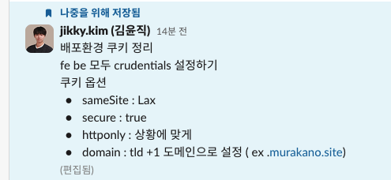
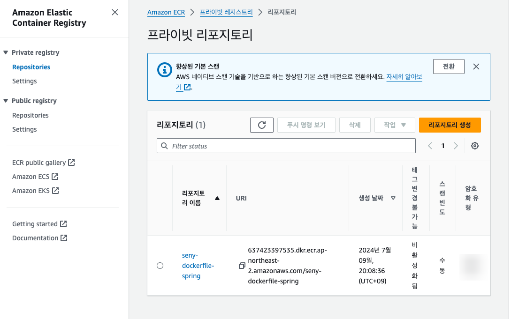
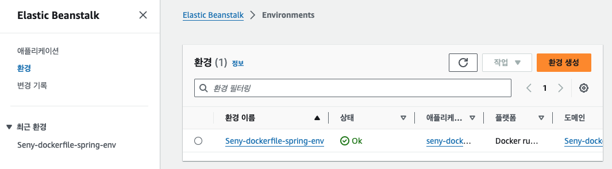
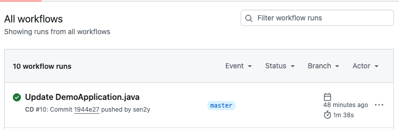
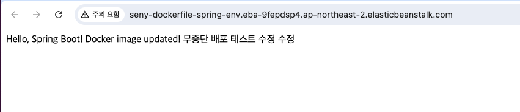

# TIL

## 날짜: 2024-07-09

### 스크럼

- 학습 목표 1 : 엘리스 코테 챌린지
- 학습 목표 2 : 검색창 연관검색어 키보드 down,up 클릭 시 focus 이동하게 만들기 + 엔터 클릭 시 검색결과 페이지로 이동
- 학습 목표 3 : 12주차 과제 제출 (무중단 배포 ECR+EB+Docker)

#### 주제 1: 어제 내용 복습



### 오늘의 도전 과제와 해결 방법

## 도전 과제 1:

### 12주차 과제 ECR, Github Action, Elastic Beanstalk, 롤링 무중단 배포

**ECR 프라이빗 리포지토리 생성** - [참고 링크](https://velog.io/@tanggu01/ECR%EC%97%90-%EB%8F%84%EC%BB%A4-%EC%9D%B4%EB%AF%B8%EC%A7%80-%EC%97%85%EB%A1%9C%EB%93%9C%ED%95%98%EA%B8%B0)

 
   
<br/>

**IAM 생성**

이름 : aws-elasticbeanstalk-ec2-role
권한 추가 :

```
AWSElasticBeanstalkWebTier
AWSElasticBeanstalkWorkerTier
AWSElasticBeanstalkMulticontainerDocker
AmazonEC2ContainerRegistryReadOnly
```

EB 애플리케이션 생성

- 웹 서버 환경, 관리형 플랫폼(Docker선택), 샘플애플리케이션, 단일인스턴스, 새 서비스역할 생성및 사용, EC2 인스턴스 프로파일은 IAM에서 생성한 역할 사용,t3마이크로, 롤링 업데이트 및 배포
  

**github action 설정**
deploy.yml

```
name: CD
on:
  push:
    branches:
      - master
jobs:
  build-and-deploy:
    runs-on: ubuntu-latest
    steps:

    - name: Checkout
      uses: actions/checkout@v2

    - name: Configure AWS Credentials
      uses: aws-actions/configure-aws-credentials@v4
      with:
        aws-region: ap-northeast-2
        aws-access-key-id: ${{ secrets.AWS_ACCESS_KEY_ID }}
        aws-secret-access-key: ${{ secrets.AWS_SECRET_ACCESS_KEY }}

    - name: Login to Amazon ECR
      id: login-ecr
      uses: aws-actions/amazon-ecr-login@v2
      with:
        registry-type: private

    - name: Build, tag, and push image to Amazon ECR
      id: build-image
      env:
        ECR_REGISTRY: ${{ steps.login-ecr.outputs.registry }}
        ECR_REPOSITORY: ${{ secrets.ECR_REPOSITORY }}
        IMAGE_TAG: latest
      run: |
        docker build -t $ECR_REGISTRY/$ECR_REPOSITORY:$IMAGE_TAG .
        docker push $ECR_REGISTRY/$ECR_REPOSITORY:$IMAGE_TAG

    - name: Generate deployment package
      run: |
        mkdir -p deploy
        cp Dockerrun.aws.json deploy/Dockerrun.aws.json
        cd deploy && zip -r deploy.zip .

    - name: Beanstalk Deploy
      uses: einaregilsson/beanstalk-deploy@v14
      with:
        aws_access_key: ${{ secrets.AWS_ACCESS_KEY_ID }}
        aws_secret_key: ${{ secrets.AWS_SECRET_ACCESS_KEY }}
        application_name: ${{ secrets.EB_APPLICATION_NAM }}
        environment_name: ${{ secrets.EB_ENVIRONMENT_NAME }}
        version_label: "v${{ github.sha }}"
        region: ap-northeast-2
        deployment_package: deploy/deploy.zip
        wait_for_environment_recovery: 200
```

그리고 프로젝트 루트위치에, Dockerrun.aws.json 파일 생성

```
{
  "AWSEBDockerrunVersion": "1",
  "Image": {
    "Name": "내AWS아이디.dkr.ecr.ap-northeast-2.amazonaws.com/seny-dockerfile-spring:latest",
    "Update": "true"
  },
  "Ports": [
    {
      "ContainerPort": 8080
    }
  ]
}
```

## 무중단 배포 성공!





https://github.com/100-hours-a-week/seny-til/assets/83276834/545608c0-4c29-4b75-a4ea-f17f1e8886b7


## 도전 과제 2:

### 위아래 키보드로 검색어 Focus 조절하고 엔터치면 검색결과 뜨기방법

주요 기능 추가 및 수정

1. SearchBar.js에서 handleSearch 함수 수정 및 포커스 인덱스 초기화
   검색어가 확정되면 포커스 인덱스를 초기화하고, Enter 키 또는 클릭 이벤트에 따라 검색어를 설정하여 검색 결과 페이지로 이동합니다.

```javascript
const [focusedIndex, setFocusedIndex] = useState(-1); // 포커스된 아이템의 인덱스
const handleSearch = (e, term) => {
  if (e.key === "Enter" || e.type === "click") {
    const searchTermToUse = term || searchTerm;
    setRememberPath(router.query.query);
    setSearchTerm(searchTermToUse);
    setFocusedIndex(-1); // 포커스 인덱스 초기화
    router.push(`/search/${encodeURIComponent(searchTermToUse)}`);
    setFirstRender(true);
    setDropdownVisible(false);
  }
};

const handleItemClick = (searchTerm) => {
  setSearchTerm(searchTerm);
  setFocusedIndex(-1); // 포커스 인덱스 초기화
  router.push(`/search/${encodeURIComponent(searchTerm)}`);
  setFirstRender(true);
  setDropdownVisible(false);
};
```

- handleSearch 함수는 검색어 확정 시 호출됩니다. term 인자가 있는 경우 해당 값을 사용하고, 그렇지 않은 경우 현재 searchTerm 상태 값을 사용합니다. 검색어가 확정되면 setSearchTerm을 호출하여 상태를 업데이트하고, 포커스 인덱스를 초기화(setFocusedIndex(-1))합니다. 그 후 검색 결과 페이지로 이동합니다.
- handleItemClick 함수는 검색어를 클릭하여 선택할 때 호출됩니다. 선택된 검색어를 setSearchTerm으로 설정하고, 포커스 인덱스를 초기화한 후 검색 결과 페이지로 이동합니다.

2. SearchBox.js에서 handleKeyDown 함수 수정
   키보드 입력을 처리하여 위아래 화살표 키로 검색어를 탐색하고, Enter 키를 눌러 선택된 검색어를 확정합니다.

```javascript
const handleKeyDown = (e) => {
  if (relatedItems && relatedItems.length > 0) {
    if (e.key === "ArrowDown") {
      e.preventDefault();
      setFocusedIndex((prevIndex) => (prevIndex + 1) % relatedItems.length);
    } else if (e.key === "ArrowUp") {
      e.preventDefault();
      setFocusedIndex(
        (prevIndex) =>
          (prevIndex - 1 + relatedItems.length) % relatedItems.length
      );
    } else if (e.key === "Enter") {
      e.preventDefault();
      const selectedTerm =
        focusedIndex === -1 ? searchTerm : relatedItems[focusedIndex];
      handleSearch(e, selectedTerm); // 포커스된 아이템을 handleSearch로 전달
    }
  }
};
```

설명:
handleKeyDown 함수는 키보드 입력을 처리합니다.
ArrowDown 키를 누르면 focusedIndex가 증가하여 다음 검색어로 이동합니다.
ArrowUp 키를 누르면 focusedIndex가 감소하여 이전 검색어로 이동합니다.
Enter 키를 누르면 현재 focusedIndex가 가리키는 검색어를 handleSearch 함수로 전달하여 검색어를 확정합니다. 포커스 인덱스가 -1인 경우 현재 searchTerm 상태 값을 사용합니다.

```
이때, `e.preventDefault()` 메서드가 겹친다고 handleKeyDown메서드 첫번째 줄에 한번 작성하게 된다면? -> 키보드 입력이 안되는 문제가 발생했다.

왜? ?
`e.preventDefault()` 함수는 이벤트의 기본 동작을 취소합니다.
이 경우, 키보드 이벤트의 기본 동작은 키 입력에 따라 입력 필드에 문자를 삽입하는 것입니다. 따라서 `e.preventDefault()`를 `handleKeyDown` 함수의 시작 부분에서 호출하면, 키 입력에 따른 기본 동작이 취소되어 입력 필드에 문자가 삽입되지 않습니다.

`e.preventDefault()`를 각 조건문 내부에서 호출하면, 해당 조건이 참일 때만 기본 동작이 취소됩니다. 따라서 'ArrowDown', 'ArrowUp', 'Enter' 키를 누를 때만 기본 동작이 취소되고, 다른 키를 누를 때는 기본 동작이 실행되어 입력 필드에 문자가 삽입됩니다.

따라서 `e.preventDefault()`를 조건문 내부에서만 호출하도록 수정해야 합니다.
```

3. SearchDropdown.js
   SearchDropdown 컴포넌트는 연관 검색어를 보여주는 드롭다운 UI를 담당합니다. 포커스된 검색어를 시각적으로 표시합니다.

```javascript
 background-color: ${(props) => (props.$focused ? 'var(--secondary)' : 'transparent')}; /* 포커스된 아이템 배경색 */
```


https://github.com/100-hours-a-week/seny-til/assets/83276834/a5d90237-b5ff-49ff-a99b-4de7cee4b3ca


### 오늘의 회고

- 검색창에 키보드 위아래 클릭시, 드롭다운에 뜨는 연관검색어들을 focus를 이동해서 검색하는 부분에 대한 구현.. 사실 어떻게 하는지 잘 모르겠어서 계속 미뤄왔었다. 관련코드들이 정리되지 않은 상태였어서 코드가 매우 더럽다. 리팩토링 꼭 해야겠다! 나머지 찝찝한 부분(엔터드롭다운관련)도 얼른 해결하고 싶다.
- 계속 사이드프로젝트에 집중만 하다가 오랜만에 과제 제출을 했다. 깡통 프로젝트이지만 Docker+ECR+EC2+깃허브액션배포, Docker+ECR+EB+깃허브액션 배포 모두 해보는 멋진 경험! 팀원이랑 같이해서 포기하지 않고 잘 해낼수있었다

### 블로그, 노션, 깃 정리 링크

- [12주차 과제 제출 페이지](https://goorm.notion.site/12-162d34c21f714b4d9d2053d7d57a7ca0?pvs=4)
