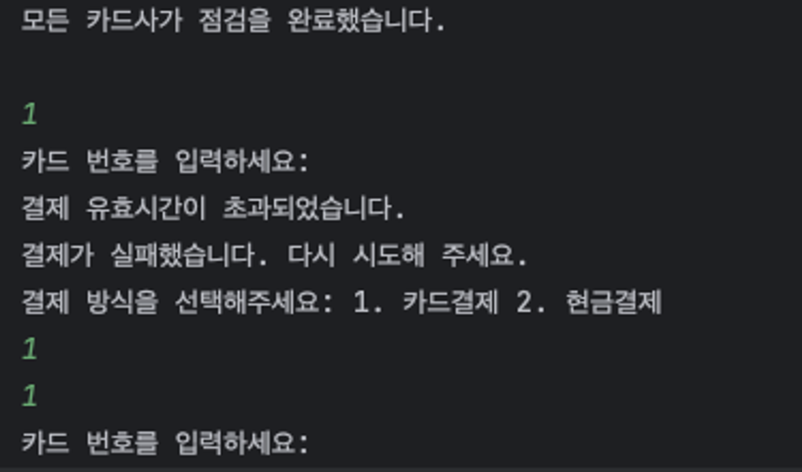
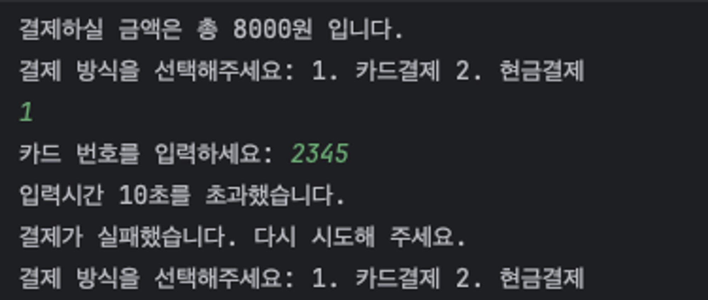

# TIL

## 날짜: 2024-06-02

### 스크럼

- 학습 목표 1 : 7주차 과제 끝내기

### 도전 과제

직면한 문제

```
10초가 지나도 스레드가 종료가 안됨 → 왜냐? 카드번호 입력받는 시점부터 10초가 아니라, 입력받고나서 처리하는 중에 10초제한 스레드가 시작되니 이게 10초를 넘어버릴수 없는거야.
```

그래서, 스레드를 새로 만들었어.

별도로

```java
System.out.print("카드 번호를 입력하세요: ");
//        String cardNumber = scanner.nextLine(); // 카드 번호 입력 받기
        AtomicReference<String> cardNumber = new AtomicReference<>(); // AtomicReference 초기화
        Scanner scanner = new Scanner(System.in);
        // 결제 스레드 생성
        Thread inputThread = new Thread(() -> {
            cardNumber.set(scanner.nextLine());
        });

        inputThread.start(); // 카드번호 입력 시간제한 스레드 시작

        // 스레드가 인터럽트되었는지 확인
        try {
            inputThread.join(10 * 1000); // 10초 동안 스레드 대기
            if (inputThread.isAlive()) {
                inputThread.interrupt(); // 스레드가 아직 실행 중이면 인터럽트
                // 인터럽트가 발생하면 결제 실패 처리하고 메서드 종료
                paymentInfoManager.updatePaymentStatus(paymentId, 3); // 3: 시간 초과로 상태 업데이트
                System.out.println("\n결제 유효시간이 초과되었습니다.");
                return false;
            }
        } catch (InterruptedException e) {
            e.printStackTrace();
        }
```

그랬더니 다음에 생기는 에러는?



-> 강제로 종료했더니, 입력 scanner는 닫히지 않았다.

```
💁‍♂️ scanner를 사용하여 입력값 받기로 한 이후에, 입력값 받는걸 강제로 닫을수가 없다고 한다.
그러므로 내가 의도한대로 하고싶다면, 스레드를 사용하지 말고. 입력값을 받겠다고 열어놓고 강제종료해서도 안되는 것이다.
```

입력값 받기로 한 이후에 입력값받는걸 강제로 닫을수가 없으니
스레드 방식으로 강제로 인터럽트하는건 의미가 없고,
입력을 끝까지 받은 후, 입력전후 시간차가 10초이상나는 경우 false를 반환한다.
이렇게 진행하도록 코드를 수정!

```java

        // 현재시간을 기록
        long startTime = System.currentTimeMillis();

        System.out.print("카드 번호를 입력하세요: ");
        Scanner scanner = new Scanner(System.in);
        String cardNumber = scanner.nextLine(); // 카드 번호를 입력받습니다.

        // 입력완료 후 시간찍고
        long endTime = System.currentTimeMillis();

        // 시간차를 계산 (밀리초 단위이므로 1000으로 나눠 초 단위로 변환)
        long elapsedTime = (endTime - startTime) / 1000;

        // 시간차가 10초가 넘으면 false 반환
        if (elapsedTime > 10) {
            System.out.println("입력시간 10초를 초과했습니다. ");
            return false;
        }
```



### **비동기 로직과 기능 요약**

### **1. 카드사 점검 주기 관리 (`MaintenanceCycle`)**

- **클래스**: **`MaintenanceCycle`**
- **비동기 특성**:
  - 별도의 스레드에서 실행되어 주기적으로 카드사 점검 상태를 업데이트하는 스레드.
  - **`MaintenanceCycle`**은 별도의 스레드에서 실행되어 카드사의 점검 상태를 주기적으로 업데이트하므로, 메인 프로그램의 실행에 영향을 주지 않고 독립적으로 데이터를 관리한다.
- **기능**:
  - 2분마다 1분 동안 카드사 점검 상태를 **`true`**로 설정하고, 그 후에 다시 **`false`**로 설정. 이는 **`BankInfoManager`**를 통해 관리되며, 카드사 점검 중일 때는 결제가 되지 않는다.
    ```json
    // banks.json **JSON 구조 예시**
    [
      { "bankName": "국민카드", "maintenance": false },
      { "bankName": "우리카드", "maintenance": false }
    ]
    ```
  - **`BankInfoManager`** 클래스는 아래 JSON 데이터를 사용하여 각 카드사의 점검 상태를 실시간으로 관리한다. **`MaintenanceCycle`** 클래스가 주기적으로 JSON 데이터를 읽어, **`maintenance`** 필드를 업데이트하여 점검 상태를 반영한다.
    ```java
    // Main 클래스에서 메인스레드 실행될 때, 카드사 점검 스레드도 생성하고 시작한다.
    Thread maintenanceThread = new Thread(new MaintenanceCycle((bankInfoManager)));
    maintenanceThread.start(); // 카드사 점검 주기 스레드 시작
    ```
    ```java
    @Override
        public void run() {
            while (true) { // 무한 루프
                try {
                    bankInfoManager.updateBankMaintenance("국민카드", false); // 초기 상태 설정
                    bankInfoManager.updateBankMaintenance("우리카드", false); // 초기 상태 설정
                    Thread.sleep(MAINTENANCE_CYCLE); // 2분 대기
                    bankInfoManager.updateBankMaintenance("국민카드", true); // 점검 상태로 설정
                    bankInfoManager.updateBankMaintenance("우리카드", true); // 점검 상태로 설정
                    System.out.println("");
                    System.out.println("모든 카드사가 점검 중입니다. (1분간)"); // 점검 시작 메시지 출력
                    System.out.println("");
                    Thread.sleep(MAINTENANCE_DURATION); // 1분 대기
                    bankInfoManager.updateBankMaintenance("국민카드", false); // 점검 상태 해제
                    bankInfoManager.updateBankMaintenance("우리카드", false); // 점검 상태 해제
                    System.out.println("");
                    System.out.println("모든 카드사가 점검을 완료했습니다."); // 점검 완료 메시지 출력
                    System.out.println("");
                } catch (InterruptedException e) {
                    Thread.currentThread().interrupt(); // 스레드 인터럽트 상태 복원
                    e.printStackTrace();
                }
            }
        }
    }
    ```

### **2. 카드 결제 처리 (`CardService`)**

- **클래스**: **`CardService`**
- **비동기 특성**: 결제를 처리하는 로직을 별도의 스레드에서 실행합니다. 이는 카드 결제가 백그라운드에서 처리되도록 하여 사용자 인터페이스의 응답성을 높입니다.
- **기능**:
  - 사용자가 카드 번호를 입력하면, 해당 정보를 사용하여 비동기적으로 결제를 시도한다. 은행 점검 상태인 경우에는 즉시 거절된다.
    ```json
    // **카드 잔고 JSON 구조 예시**
    [
        {"cardNumber":"1234","cardType":"국민카드","balance":1000},
        ...
    ]
    ```
  - 사용자가 카드 번호를 입력하면 **`CardService`**는 JSON 데이터를 조회하여 해당 카드의 잔고와 타입을 확인한다. 사용자가 입력한 카드 번호가 유효하고, 잔고가 충분할 경우에만 결제를 승인하고, 잔고를 업데이트한다.
    ```java
    Thread paymentThread = new Thread(new PaymentProcessRun(
        cardNumber, amount, paymentId
    ));
    paymentThread.start(); // 결제 처리 스레드 시작
    ```
    ```java
    @Override
        public void run() {

            // JSON 파일에서 paymentId 를 찾아서 결제 상태를 확인하고, 결제가 완료되었으면 return true
            if (bankInfoManager.getBankInfo(bankName).isMaintenance()) { // 점검 상태 확인
                // payment.json 정상처리가 되지 않았음을 남김 (paymentId 기준으로)
    //            System.out.println("\n카드사가 현재 점검 중입니다.");
                // 콜러에서 안내 메시지를 출력하도록 변경
                return;
            }

            CardInfoManager.Card card = cardInfoManager.getCardInfo(cardNumber);
            if (card != null && card.getCardNumber().equals(cardNumber)) {
                int balance = card.getBalance() - amount;
                if (balance < 0) {
                    System.out.println("잔액이 부족합니다.");
                    paymentInfoManager.updatePaymentStatus(paymentId, 0);
                    return;
                }
                System.out.println("결제가 완료되었습니다. 남은 잔액: " + balance + "원"); // 결제 완료 메시지 출력
                paymentInfoManager.updatePaymentStatus(paymentId, 1);
                cardInfoManager.updateCardBalance(card.getCardNumber(), amount);

            } else if (!bankInfoManager.getBankInfo(bankName).isMaintenance()) {
                System.out.println("카드정보가 존재하지 않습니다.");
                paymentInfoManager.updatePaymentStatus(paymentId, 0);
            }

        }
    }
    ```

### **3. 결제 핸들러 (`CardPaymentHandler`)**

- **클래스**: **`CardPaymentHandler`**
- **비동기 특성**:
  - 결제 처리가 백그라운드에서 실행되며, 카드사의 점검 상태에 따라 결제 승인 여부가 결정된다.
  - 결제 처리는 **`CardService`** 내부에서 별도의 스레드(**`PaymentProcessRun`**)를 통해 실행되므로, 사용자의 입력과 결제 처리 간의 지연 없이 효율적으로 운영된다.
- **기능**:
  - **`CardPaymentHandler`**는 **`CardService`**를 사용하여 카드 결제를 처리하며, **`CashPaymentHandler`**는 현금 결제를 처리한다. 두 핸들러 모두 사용자로부터 결제 방식에 따른 선택을 받는다.
    ```json
    // **결제 정보 JSON 구조 예시**
    [
        {"paymentId":1,"amount":8000,"status":1},
        ...
    ]
    ```
    ```java
    int status = paymentInfoManager.getPaymentInfo(paymentId).getStatus();
            if (status == 1) { // 결제가 성공하여 상태가 1(결제 완료)인 경우
                paymentProcessed.set(true); // 결제가 성공하면 결제 처리 여부를 true로 설정합니다.
            }
    ```
  - 카드 결제 요청 시, **`PaymentInfoManager`**는 새로운 **`paymentId`**를 생성하고, 이를 JSON에 추가한다. 결제 처리의 성공 여부에 따라 **`status`** 필드를 업데이트한다. **`status`** 값이 '1'인 경우만 결제가 성공한 것으로 처리하며, 1이 아닌 경우 1이 될 때까지 결제 단계를 반복한다.
    - `0` : 초기화/결제실패, `1` : 결제성공, `2`: 점검중

++ 추가 구현,

카드 결제 선택 시,

### **카드 번호 입력 시간 제한 로직 구현**

<aside>
👉 카드 번호 입력에 대한 시간 제한 기능을 구현한 부분은 사용자가 카드 결제를 선택하고 카드 번호를 입력하는 과정에서 응답 시간을 제한하여, 특정 시간 내에 입력이 완료되지 않을 경우 결제 진행을 중단하고 다시 결제 수단을 선택하도록 하는 로직이다. 
이는 사용자의 신속한 입력을 유도하고, 시스템의 효율성을 높이는 데 기여한다.

</aside>

```java
 // 현재시간을 기록
long startTime = System.currentTimeMillis();

System.out.print("카드 번호를 입력하세요: ");
Scanner scanner = new Scanner(System.in);
String cardNumber = scanner.nextLine(); // 카드 번호를 입력받습니다.

// 입력완료 후 시간찍고
long endTime = System.currentTimeMillis();

// 시간차를 계산 (밀리초 단위이므로 1000으로 나눠 초 단위로 변환)
long elapsedTime = (endTime - startTime) / 1000;

// 시간차가 10초가 넘으면 false 반환
if (elapsedTime > 10) {
    System.out.println("입력시간 10초를 초과했습니다. ");
    return false;
}
```

1. **시작 시간 기록**: 사용자에게 카드 번호 입력을 요청하기 직전에 현재 시간을 밀리초 단위로 기록
2. **카드 번호 입력 요청**: 시스템은 사용자에게 카드 번호 입력을 요청한다. 사용자는 입력을 시작하고, 입력이 완료되면 다음 단계로 넘어간다.
3. **종료 시간 기록**: 카드 번호 입력이 완료된 직후에 현재 시간을 다시 밀리초 단위로 기록한다.
4. **시간 차 계산**: 입력 시작과 종료 사이의 시간 차이를 계산하여, 이를 초 단위로 변환한다. 이 과정에서 밀리초 값을 1000으로 나누어 초 단위로 조정한다.
5. **시간 초과 검사**: 입력에 소요된 시간이 10초를 초과하는 경우, 시스템은 사용자에게 시간 초과 메시지를 표시하고, **`false`**를 반환하여 결제 과정을 중단한다.

### 오늘의 회고

- 오늘의 학습 경험에 대한 자유로운 생각이나 느낀 점을 기록합니다.
- 성공적인 점, 개선해야 할 점, 새롭게 시도하고 싶은 방법 등을 포함할 수 있습니다.

### 블로그, 노션, 깃 정리 링크

- [링크 제목](URL)
- [링크 제목](URL)
