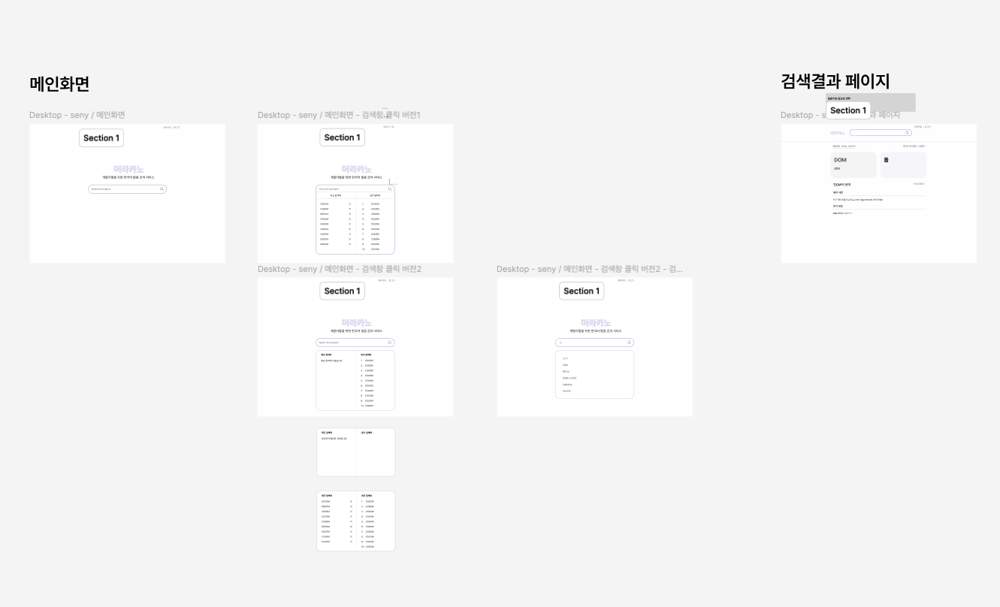

# TIL

## 날짜: 2024-06-15

### 스크럼

- 학습 목표 1 : 딥다이브 - @Transactional에 대해 정리
- 학습 목표 2 : 미니 프로젝트 1주차 회의 ( 기획 상세 )
- 학습 목표 3 : 피그마 디자인 구현 ( 메인화면, 검색결과 페이지 )
  

### 새로 배운 내용

#### 주제 1: @Transactional에 대해 정리

# 트랜잭션이란?

데이터베이스 트랜잭션은 데이터베이스 관리 시스템 또는 유사한 시스템에서 상호작용의 단위이다.

여기서 단위라는 말을 사용했는데, 쉽게 말하면 더 이상 쪼개질 수 없는 최소의 연산이라는 의미가 된다.

```
🤸‍♂️ **트랜잭션 과정 중에 다른 연산이 끼어들 수 없다.**

**오류가 생긴 경우 연산을 취소하고 원래대로 되돌린다. 성공할 경우 결과를 반영한다.**

```

그래서 어떤 연산에 트랜잭션이 보장된다면, DB에서 의도치 않은 값이 저장되거나 조회되는 것을 막을 수 있다.

위와 같은 특징들로 인해, CRUD 작업 도중 오류가 발생하더라도 rollback해서 DB에 해당 결과가 반영되지 않게 하므로 값의 신뢰성이 보장될 수 있다.

---

# `@Transactional` 어노테이션

`@Transactional` 어노테이션은 **스프링 프레임워크**에서 트랜잭션 관리를 위해 사용되는 중요한 어노테이션으로, 메서드나 클래스에 적용되어 해당 범위 내의 모든 메서드가 하나의 트랜잭션 내에서 실행되도록 보장해준다.

<aside>
🤸‍♂️ **선언적 트랜잭션**이라고도 하는데, 직접 객체를 만들 필요 없이 선언만으로 관리가 용이하다는 의미이다.

</aside>

SpringBoot에서는 선언적 트랜잭션에 필요한 여러 설정이 되어 있어 더 쉽게 사용 가능하다.

- 메서드에 선언 : 해당 메서드에만 적용된다.
  ```java
  // 메소드 단위 설정
  // test() 메소드에 적용
  @Service
  public class TestService {

  	@Transactional
  	public void test() {
  	}

  	public void test2() {
  	}
  }
  ```
- 클래스에 선언 : 해당 클래스에 속하는 메서드에 공통적으로 적용된다.

  ```java
  //클래스 단위 설정
  // test(), test2() 메서드에 적용
  @Service
  @Transactional
  public class TestService {

  	public void test() {

  	}

  	public void test2() {

  	}

  }
  ```

- 세부 설정 적용: 트랜잭션의 다양한 속성을 설정하여 세부적인 트랜잭션 관리가 가능하다.
  ```java
  @Service
  public class MyService {

      @Transactional(propagation = Propagation.REQUIRED, isolation = Isolation.READ_COMMITTED, timeout = 5, readOnly = false)
      public void performTransaction() {
          // 트랜잭션 내에서 수행할 작업
      }
  }
  ```

## 트랜잭션 관리의 중요성

트랜잭션 관리는 데이터의 일관성과 무결성을 유지하기 위해 필수적이다.

`@Transactional` 어노테이션을 사용하면 복잡한 트랜잭션 관리를 간단하게 처리할 수 있으며, 코드의 가독성과 유지보수성을 높여준다. 스프링 프레임워크의 트랜잭션 관리 기능을 잘 활용하면 애플리케이션의 안전성과 성능을 극대화할 수 있다.

---

# `@Transactional` 작동 원리와 흐름

**@Transactional이 붙은 메서드를 호출할 경우, 코드는 어떻게 동작할까?**

`@Transactional`이 클래스 내 메서드에 사용되면,

- Spring은 해당 메서드에 대한 트랜잭션이 적용된 **프록시 객체** 생성
- 프록시 객체는 `@Transactional` 이 포함된 메서드가 호출될 경우, 트랜잭션을 시작하고 Commit or Rollback을 수행
  - CheckedException or 예외가 없는 경우 `Commit`
  - UncheckedException이 발생하면 `Rollback`

```
🤸‍♂️ 프록시 패턴은 디자인 패턴 중 하나로, 어떤 코드를 감싸면서 추가적인 연산을 수행하도록 강제하는 방법이다.
```

**💁‍♂️ [AOP Proxy 추가 공부가 필요하다면?](https://velog.io/@chullll/Transactional-%EA%B3%BC-PROXY)**

트랜잭션의 경우, 트랜잭션의 시작과 연산 종료시의 커밋 과정이 필요하므로, 프록시를 생성해 해당 메서드의 앞뒤에 트랜잭션의 시작과 끝을 추가하는 것이다. \*프록시를 이용하여 트랜잭션을 동작시킨다!

이러한 로직은 Spring AOP에 바탕을 두고 설계되었기 때문에, 해당 프록시를 트랜잭션 AOP라고 하고 다음 그림을 이해해보자.


스프링 컨테이너는 트랜잭션 범위의 **영속성 컨텍스트 전략**을 기본으로 사용한다.

@Transactional 을 사용할 경우, 해당 코드 내의 메서드를 호출할 때 영속성 컨텍스트가 생긴다는 뜻이다.

<aside>
🤸‍♂️ 1. AOP를 사용해서 트랜잭션 범위를 지정할 때, 해당 패키지 내에서 일어나는 모든 이벤트는 트랜잭션의 영향을 받는다.
2. 트랜잭션 AOP가 트랜잭션을 시작할 때 영속성 컨텍스트가 생성되며, 메서드 실행이 종료되어 트랜잭션 AOP가 트랜잭션을 커밋할 경우 영속성 컨텍스트가 flush되어 해당 내용이 데이터베이스에 반영된다.

</aside>

이러한 방식으로 영속성 컨텍스트를 관리해주기 때문에, @Transactional 을 쓸 경우 트랜잭션의 원칙을 정확히 지킬 수 있다.

**\*추가 원칙**

- 만약 같은 트랜잭션 내에서 여러 EntityManager를 쓰더라도, 이는 같은 영속성 컨텍스트를 사용한다.
  - 트랜잭션이 시작되면 영속성 컨텍스트가 하나 생성된다.
  - 동일한 트랜잭션 내에서 여러 EntityManager 인스턴스를 사용하더라도, 이들은 모두 동일한 영속성 컨텍스트를 참조한다.
  - 이렇게 하면 트랜잭션 내에서 여러 EntityManager를 사용할 때 일관된 엔티티 상태를 유지할 수 있다.
- 같은 EntityManager를 쓰더라도, 트랜잭션이 다르면 다른 영속성 컨텍스트를 사용한다.
  - 동일한 EntityManager 인스턴스를 사용하더라도 트랜잭션이 다르면 각 트랜잭션마다 각각 다른 영속성 컨텍스트를 생성하게 된다.
  - 이는 트랜잭션 간의 독립성을 보장하여, 한 트랜잭션의 변경 사항이 다른 트랜잭션에 영향을 미치지 않도록 한다.
- 추가개념 AOP, 영속성 컨텍스트, EntityManager
  **AOP**는 "Aspect-Oriented Programming"의 약자로, 관점 지향 프로그래밍을 의미한다.
  **AOP를 통해 트랜잭션이 발생하는 범위를 지정할 수 있다!**
  ```
  🤸‍♂️ 관점 지향은 어떤 로직을 기준으로 핵심적인 관점, 부가적인 관점으로 나누어서 보고 그 관점을 기준으로 각각 모듈화하여 코드의 재사용성을 높이는 프로그래밍 패러다임이다.

  ```
  **영속성 컨텍스트** : 엔티티 인스턴스들을 관리하고, 데이터베이스와의 동기화를 담당하는 일종의 캐시이다.
  ```
  🤸‍♂️ 영속성 컨텍스트는 일종의 캐시로, 엔티티 객체의 상태를 추적하여, 트랜잭션이 커밋될 때 변경된 내용을 데이터베이스에 반영한다.

  ```
  **EntityManager** : 영속성 컨텍스트를 관리하는 인터페이스로, 엔티티를 CRUD하는 작업을 수행한다.
- AOP 참고
  1. @Aspect 라는 어노테이션으로 별도로 설정 가능함
  2. @Transactional 을 통해서 해당 메서드 이하에 호출되는 모든 메서드는 모두 트랜잭션의 영향을 받도록도 할 수 있음
  ```
  🤸‍♂️ AOP의 특징으로 인해 2번이 되는거고, 특별히 더 별도로 설정하고 싶다면 @Aspect로 가능한 것

  ```

## `@Transactional` 적용 시, 주의사항

- private 접근자는 @Transactional로 선언할 수 없다.
  - Transaction은 Proxy를 이용하고, Proxy를 사용하려면 오버라이딩이 가능해야 한다.
  - IDE에서 Private 접근자에 @Transactional을 선언하면 오류 메시지를 띄운다.
- 비 Transaction 메서드에서, Transaction 메서드를 호출하면 **Transaction 적용이 안된다.**
  ```java
  public void notTransaction(){
  	isTransaction(); // Transaction 적용 안된다.
  }

  @Transactional
  public void isTransaction(){
  	System.out.println("transaction");

      throw new RuntimeException();
  }
  ```

---

# 주요 속성

| 속성                   | 타입                                           | 설명                                                          |
| ---------------------- | ---------------------------------------------- | ------------------------------------------------------------- |
| value                  |  String                                        | 사용할 트랜잭션 관리자                                        |
| propagation            | enum: Propagation                              | 선택적 전파 설정                                              |
| isolation              | enum: Isolation                                | 선택적 격리 수준                                              |
| readOnly               | boolean                                        | 읽기/쓰기 vs 읽기 전용 트랜잭션                               |
|  timeout               | int (초)                                       | 트랜잭션 타임 아웃                                            |
| rollbackFor            | Throwable 로부터 얻을 수 있는 Class 객체 배열  | 롤백이 수행되어야 하는, 선택적인 예외 클래스의 배열           |
| rollbackForClassName   | Throwable 로부터 얻을 수 있는 클래스 이름 배열 | 롤백이 수행되어야 하는, 선택적인 예외 클래스 이름의 배열      |
| noRollbackFor          | Throwable 로부터 얻을 수 있는 Class 객체 배열  | 롤백이 수행되지 않아야 하는, 선택적인 예외 클래스의 배열      |
| noRollbackForClassName | Throwable 로부터 얻을 수 있는 클래스 이름 배열 | 롤백이 수행되지 않아야 하는, 선택적인 예외 클래스 이름의 배열 |

## 1. 트랜잭션 전파(Propagation)

트랜잭션 전파 속성은 현재 트랜잭션이 어떻게 다른 트랜잭션과 상호작용할지 결정한다.

주요 전파 옵션은 다음과 같다.

- `REQUIRED` (기본값): 현재 트랜잭션이 존재하면 그 트랜잭션을 사용하고, 존재하지 않으면 새로운 트랜잭션을 시작한다.
  ```java
  @Transactional(propagation = Propagation.REQUIRED)
  public void performTransaction() {
      // 트랜잭션 내에서 수행할 작업
  }
  ```
- `REQUIRES_NEW` : 항상 새로운 트랜잭션을 시작, 기존 트랜잭션은 일시 중단된다.
- `MANDATORY`: 반드시 기존 트랜잭션이 존재해야 한다. 트랜잭션이 없으면 예외를 발생시킨다.
- `SUPPORTS`: 현재 트랜잭션이 존재하면 사용하고, 없으면 트랜잭션 없이 실행한다.
- `NOT_SUPPORTED`: 트랜잭션 없이 실행하며, 기존 트랜잭션이 존재하면 일시 중단한다.
- `NEVER`: 트랜잭션 없이 실행하며, 트랜잭션이 존재하면 예외를 발생시킨다.
- `NESTED`: 현재 트랜잭션이 존재하면 중첩 트랜잭션을 시작한다.

## 2. 트랜잭션 격리 수준(Isolation)

트랜잭션 격리 수준은 트랜잭션 간의 데이터 격리를 제어한다. 주요 옵션은 다음과 같다.

- `DEFAULT`: 데이터베이스의 기본 격리 수준을 따른다.
  ```java
  @Transactional(isolation = Isolation.DEFAULT)
  public void performDefaultIsolationTransaction() {
      // 기본 격리 수준에서 수행할 작업
  }
  ```
- `READ_UNCOMMITTED`: 다른 트랜잭션이 커밋하지 않은 데이터를 읽을 수 있다.
- `READ_COMMITTED`: 다른 트랜잭션이 커밋한 데이터만 읽을 수 있다.
- `REPEATABLE_READ`: 트랜잭션 내에서 동일한 쿼리를 여러 번 실행해도 동일한 결과를 보장한다.
- `SERIALIZABLE`: 가장 높은 격리 수준으로, 트랜잭션을 순차적으로 실행하여 데이터의 완전한 격리를 보장한다.

## 3. 트랜잭션 타임아웃(Timeout)

트랜잭션이 완료되기까지 허용되는 최대 시간을 설정할 수 있다. 기본값은 제한이 없다.

설정된 시간 내에 트랜잭션이 완료되지 않으면 트랜잭션이 롤백된다.

```java
@Transactional(timeout = 5)  // 트랜잭션 최대 시간 5초
public void performTimeoutTransaction() {
    // 트랜잭션 내에서 수행할 작업
}
```

## 4. 읽기 전용(Read-only)

읽기 전용 트랜잭션으로 설정하여 데이터의 변경을 방지할 수 있다. 주로 조회 작업에 사용되며, 성능 최적화에 도움이 된다.

```java
@Transactional(readOnly = true)
public void performReadOnlyTransaction() {
    // 읽기 전용 트랜잭션 내에서 수행할 작업
}
```

## 5. 롤백 규칙 (Rollback Rules)

어떤 예외가 발생할 때 트랜잭션을 롤백할지를 설정할 수 있다.

기본적으로 런타임 예외가 발생하면 트랜잭션이 롤백된다.

하지만 특정 예외에 대해서만 롤백하거나, 특정 예외를 무시할 수도 있다.

- 특정 예외에 대해 롤백 설정

```java
@Transactional(rollbackFor = Exception.class)  // 모든 예외에 대해 롤백
public void performRollbackForTransaction() {
    // 특정 예외 발생 시 롤백할 작업
}
```

- 특정 예외를 무시하고 롤백하지 않도록 설정

```java
@Transactional(noRollbackFor = SomeException.class)  // 특정 예외에 대해 롤백하지 않음
public void performNoRollbackForTransaction() {
    // 특정 예외 발생 시 롤백하지 않을 작업
}
```

### 오늘의 회고

- 과제와 별도인 사이드 프로젝트 시작!
- 언제나 정규과정이 먼저임을 잊지말고, 한달 기한 내 사이드 플젝을 성공적으로 마무리해보자

### 블로그, 노션, 깃 정리 링크

- [딥다이브 정리](https://goorm.notion.site/4-Transactional-819f1436584443cbaddf3950cc9e9e9a?pvs=4)
