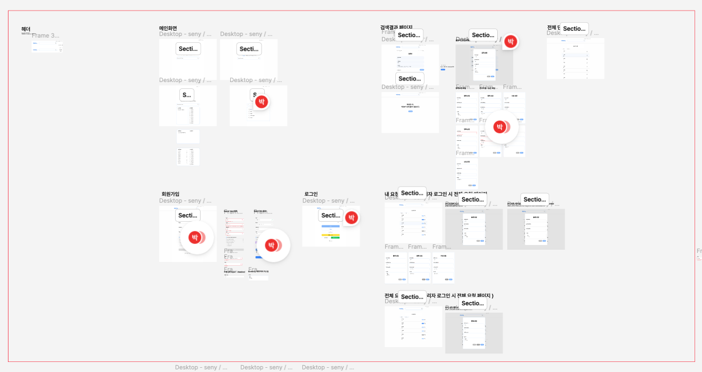
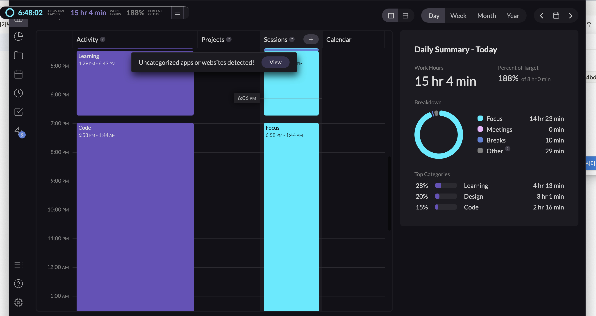

# TIL

## 날짜: 2024-06-18

### 스크럼

- 학습 목표 1 : 8주차 3번
- 학습 목표 2 : 사이드 프젝 피그마 디자인 완료 및, 프론트 서버 세팅, 프론트 배포 진행
- 학습 목표 3 : 알고리즘 강의 시작!
  

### 오늘의 도전 과제와 해결 방법

- 도전 과제 1: 프론트 서버 Next.js 도입 및 프론트 서버 세팅
  App router 14 버전과, Page router 기존 버전 중 장단점 고려, page router Next.js로 설치
  -> 3주간의 짧은 프젝 기간, 리액트가 처음인 팀원들이 있기 때문에 자료가 더 풍부한 기존 버전으로 진행
  CSS : styled-componets 사용
  prettier, eslint 와 같은 기본 설정 및 페이지 라우터 연결 완료
- 도전 과제 2: 알고리즘 강의 시작. 매일 조금씩이라도 들어보자

### 오늘의 회고

- 프젝에 대한 부담감이 큰 것 같다. 그래서 오늘 목표로한 과제를 진행하지 못했다. 내일은 과제를 위주로 진행해야겠다.

### 블로그, 노션, 깃 정리 링크

- [프론트 세팅 정리](https://jjikkky.notion.site/d142ba5939274406a554bded41ba8feb?pvs=4)

### 오늘의 공부시간 : 15h 4m

