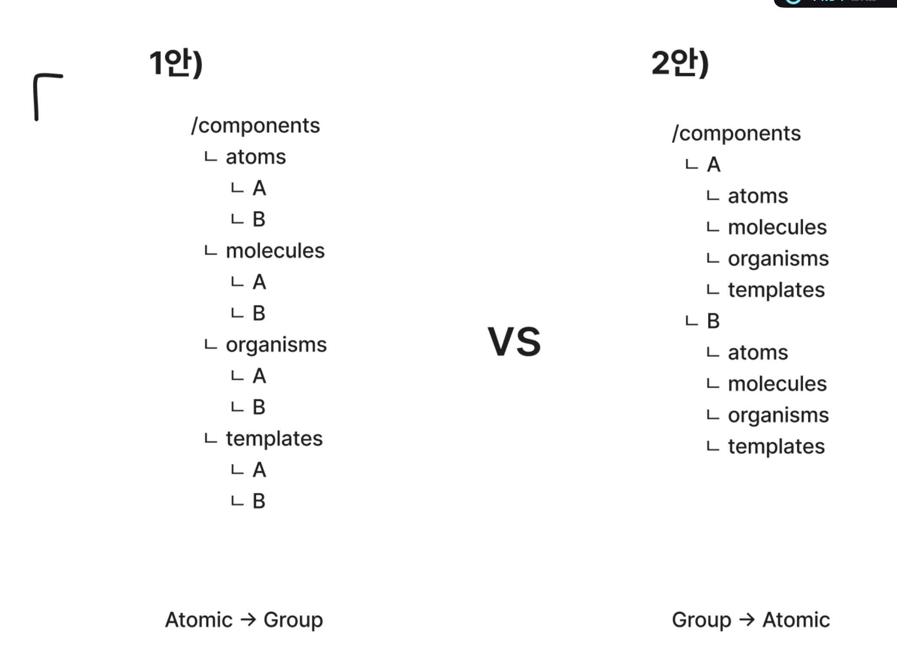
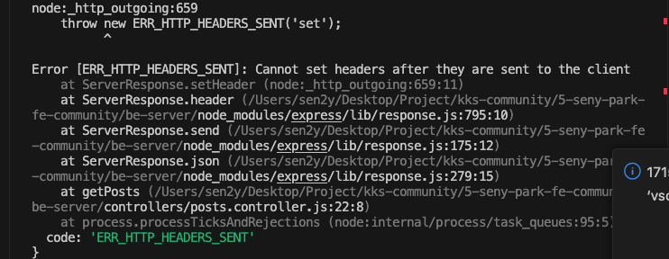
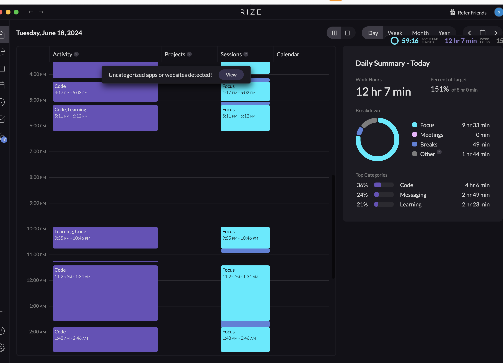

# TIL

## 날짜: 2024-06-18

### 스크럼

- 학습 목표 1 : 8주차 3번과제 찐막 끝내기!
- 학습 목표 2 : aws 프리티어 계정 생성
- 학습 목표 3 : 사이드플젝 프론트 프로젝트 세팅 - atomic 디자인 패턴 구성

### 새로 배운 내용

atomic 디자인 패턴에도 방식이 있다.
정답은 없다.
2안이 더 명확하게 체계가 정리될 것으로 판단, 이번 사이드 프젝의 프론트 프젝에서는 2안 방식으로 컴포넌트 폴더구조를 가져가보기로 하였다.



- 1안)

  ```
  atoms나 molecules의 경우 프로젝트에서 재사용할 수 있는 공통 컴포넌트들을 찾고 분류하는 게 목 적이니 컴포넌트별로 존재하면 atoms를 따로 분리하는 이유가 없지 않나? 재사용 가능한 컴포넌트와 디자 인 시스템 계층을 유지하면서 하위 그룹화를 해야겠다.
  ```

- 2안)
  ```
  요즘 유행하는 MSA(Micro Service Architecture, 마이크로 서비스 아키텍처)를 떠올려 보자. 하나 의 앱이 사실 작은 여러 가지의 앱의 집합이라고 생각한다면 각자의 앱마다 다른 컴포넌트들로 조립된 것으로 생각하지 않을까? 우리가 어떤 컴포넌트를 말할 때 이름을 먼저 떠올리지, 계층을 먼저 떠올리지 않는다.
  ```

참고 : https://yozm.wishket.com/magazine/detail/1531/

## 오늘의 도전 과제와 해결 방법

### 도전과제 1. 문제: Node.js 서버에서 Error `[ERR_HTTP_HEADERS_SENT]`

Cannot set headers after they are sent to the client 오류가 발생했습니다. 이 오류는 HTTP 응답을 두 번 보내려고 할 때 발생합니다.

getPosts 함수에서는 먼저 req.session.user가 없는 경우에 401 상태 코드와 함께 JSON 응답을 보냈습니다. 그런 다음 함수는 계속 실행되고, res.json(posts) 또는 res.status(500).json(...)를 통해 두 번째 응답을 보내려고 했습니다.

```javascript
const getPosts = async (req, res) => {
  if (!req.session.user) {
    res.status(401).json({ message: "Unauthorized" }); // 로그인이 필요함
  }
  try {
    // 게시글 목록, 작성자 정보 함께 조회
    const [posts] = await db.execute(`
      SELECT p.*, u.nickname, u.profile_image
      FROM post p
      JOIN user u ON p.user_id = u.user_id
      WHERE p.is_deleted = 0
    `);
    res.json(posts);
  } catch (err) {
    console.error(err);
    res
      .status(500)
      .json({ message: "게시글 불러오기에 실패했습니다.", error: err.message });
  }
};
```



### 해결 방법: 첫 번째 응답을 보낸 후 함수를 종료하도록 코드를 수정했습니다. 이를 위해 return 문을 추가했습니다.

```javascript
const getPosts = async (req, res) => {
  if (!req.session.user) {
    return res.status(401).json({ message: "Unauthorized" }); // 로그인이 필요함
  }
  try {
    // 게시글 목록, 작성자 정보 함께 조회
    const [posts] = await db.execute(`
      SELECT p.*, u.nickname, u.profile_image
      FROM post p
      JOIN user u ON p.user_id = u.user_id
      WHERE p.is_deleted = 0
    `);
    return res.json(posts);
  } catch (err) {
    console.error(err);
    return res
      .status(500)
      .json({ message: "게시글 불러오기에 실패했습니다.", error: err.message });
  }
};
```

이렇게 수정하면, 각 분기에서 함수가 종료되어 HTTP 응답이 한 번만 보내집니다. 이로써 ERR_HTTP_HEADERS_SENT 오류가 해결되었습니다.

### 도전 과제 2: 트랜잭션 쿼리문 `connection.execute`

```javascript
const deletePost = async (req, res) => {
  // ...
  const connection = await db.getConnection();
  await connection.beginTransaction();
  // ...
  const [posts] = await connection.execute(
    "SELECT * FROM post WHERE post_id = ?",
    [postId]
  );
  // ...
};
```

이 코드에서 connection은 데이터베이스와의 연결을 나타냅니다. db.getConnection()을 호출하여 데이터베이스와의 연결을 얻고, 이 연결을 사용하여 트랜잭션을 시작합니다(connection.beginTransaction()).

그런 다음 connection.execute를 사용하여 SQL 쿼리를 실행합니다. 이 때 connection.execute는 connection이 가리키는 데이터베이스 연결을 사용하여 쿼리를 실행하므로, 이 쿼리는 시작한 트랜잭션의 일부가 됩니다.

만약 이 부분에서 db.execute를 사용했다면, db.execute는 새로운 데이터베이스 연결을 사용하여 쿼리를 실행하므로, 이 쿼리는 트랜잭션의 일부가 아니게 됩니다. 따라서 이 쿼리가 실패하더라도 트랜잭션을 롤백할 수 없습니다.

따라서 이 코드에서는 connection.execute를 사용하여 트랜잭션을 사용하고 있습니다. 이렇게 하면, 게시글 삭제와 관련된 모든 쿼리가 성공적으로 완료되거나, 하나라도 실패하면 모든 쿼리의 결과를 롤백하여 데이터의 일관성을 유지할 수 있습니다.

### 도전과제 3. 회원가입 로직 구현 추가 with 트랜잭션

```
구현 목표 : 회원 탈퇴 시, 사용자가 작성한 게시글과 댓글 논리적 삭제 및 삭제되 게시글에 달린 댓글들도 논리적 삭제
```

- router

```javascript
// 회원 탈퇴
usersRouter.delete("/delete", usersController.deleteUser);
```

- controller

```javascript
/ 회원 탈퇴
const deleteUser = async (req, res) => {
  if (!req.session.user) {
    return res.status(401).json({ message: "Unauthorized" });
  }

  const userId = req.session.user.id;

  try {
    // 트랜잭션 시작
    const connection = await db.getConnection();
    await connection.beginTransaction();

    // 사용자가 작성한 게시글 ID 찾기
    const [userPosts] = await connection.query(
      "SELECT post_id FROM post WHERE user_id = ?",
      [userId]
    );

    // 사용자가 작성한 게시글에 달린 댓글 논리적 삭제
    for (let post of userPosts) {
      await connection.query(
        "UPDATE comment SET is_deleted = 1, deleted_at = NOW() WHERE post_id = ?",
        [post.post_id]
      );
    }

    // 사용자가 작성한 댓글 논리적 삭제
    await connection.query(
      "UPDATE comment SET is_deleted = 1, deleted_at = NOW() WHERE user_id = ?",
      [userId]
    );

    // 사용자가 작성한 게시글 논리적 삭제
    await connection.query(
      "UPDATE post SET is_deleted = 1, deleted_at = NOW() WHERE user_id = ?",
      [userId]
    );

    // 사용자 논리적 삭제
    await connection.query(
      "UPDATE user SET is_deleted = 1, deleted_at = NOW() WHERE user_id = ?",
      [userId]
    );

    // 트랜잭션 커밋
    await connection.commit();

    // 연결 해제
    connection.release();

    // 세션 삭제
    req.session.destroy((err) => {
      if (err) {
        return res.status(500).send("Failed to logout");
      }
      res.status(200).send("Account deleted and logged out");
    });
  } catch (err) {
    // 에러 발생 시 롤백
    await connection.rollback();
    // 연결 해제
    connection.release();
    console.error(err);
    return res.status(500).json({
      message: "Database error. - 회원 탈퇴에 실패했습니다.",
      error: err.message,
    });
  }
};
```

- 프론트 코드

```javascript
// 회원탈퇴 모달 팝업 이벤트
const bodyEl = document.querySelector("body");
const delEl = document.querySelector(".link .delete");
const modalProfileEl = document.querySelector(".shadow-profile");
const cancelProfileBtn = document.querySelector(".shadow-profile .cancel");
const confirmProfileBtn = document.querySelector(".shadow-profile .delete");

setupModalToggle(delEl, modalProfileEl, bodyEl);
setupModalToggle(cancelProfileBtn, modalProfileEl, bodyEl);
setupModalToggle(confirmProfileBtn, modalProfileEl, bodyEl, "/");

// 회원 탈퇴 확인 버튼에 클릭 이벤트 리스너 추가 (탈퇴 요청)
confirmProfileBtn.addEventListener("click", async () => {
  const response = await fetch(`http://localhost:4000/users/delete`, {
    method: "DELETE",
    credentials: "include", // 쿠키를 요청과 함께 보내도록 설정
  });
  if (response.status === 200) {
    location.href = "/";
  }
});
```

### 오늘의 회고

- 과제할때면 생각보다 집중을 못하는 것 같다. 다시 빡세게 집중해보자
- 누적된 피로가 쌓였었는데, 수업끝나고 한숨자니 좀 나아졌다.

### 블로그, 노션, 깃 정리 링크

- [feature/ 게시글, 댓글 DB 연동 완료 JSON -> MySQL](https://github.com/100-hours-a-week/5-seny-park-community/pull/16)
- [components 폴더 구조 - atomic 디자인 패턴 반영 #1](https://github.com/Murakano/murakano-fe/pull/1)

### 오늘의 공부 시간 : 12h 7m


