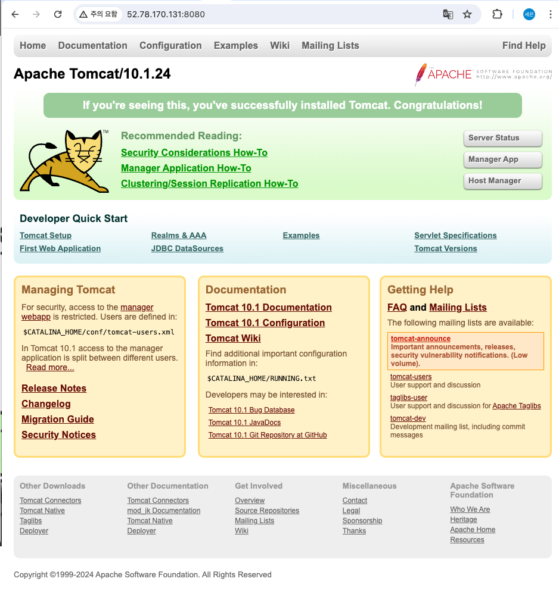
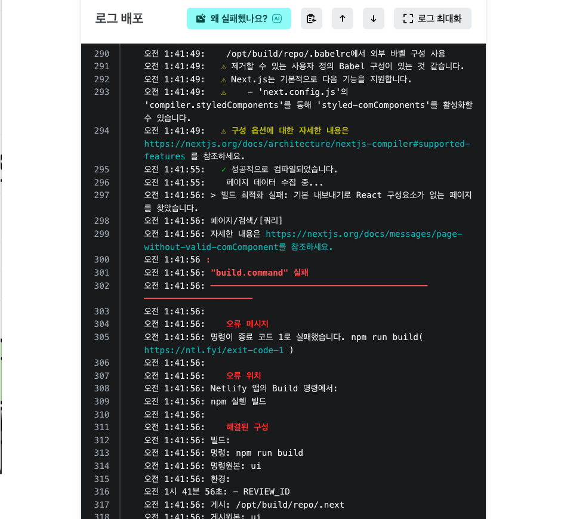
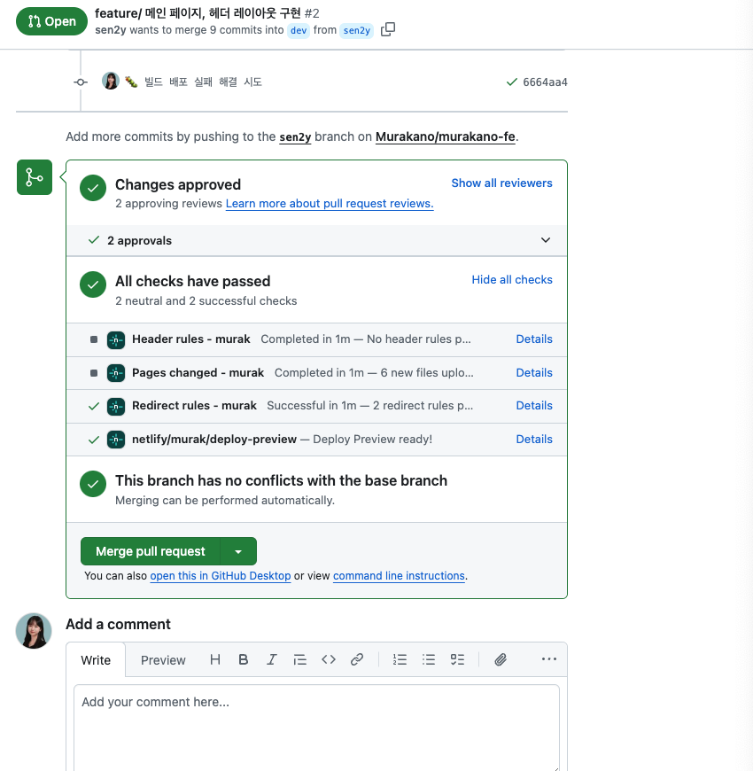
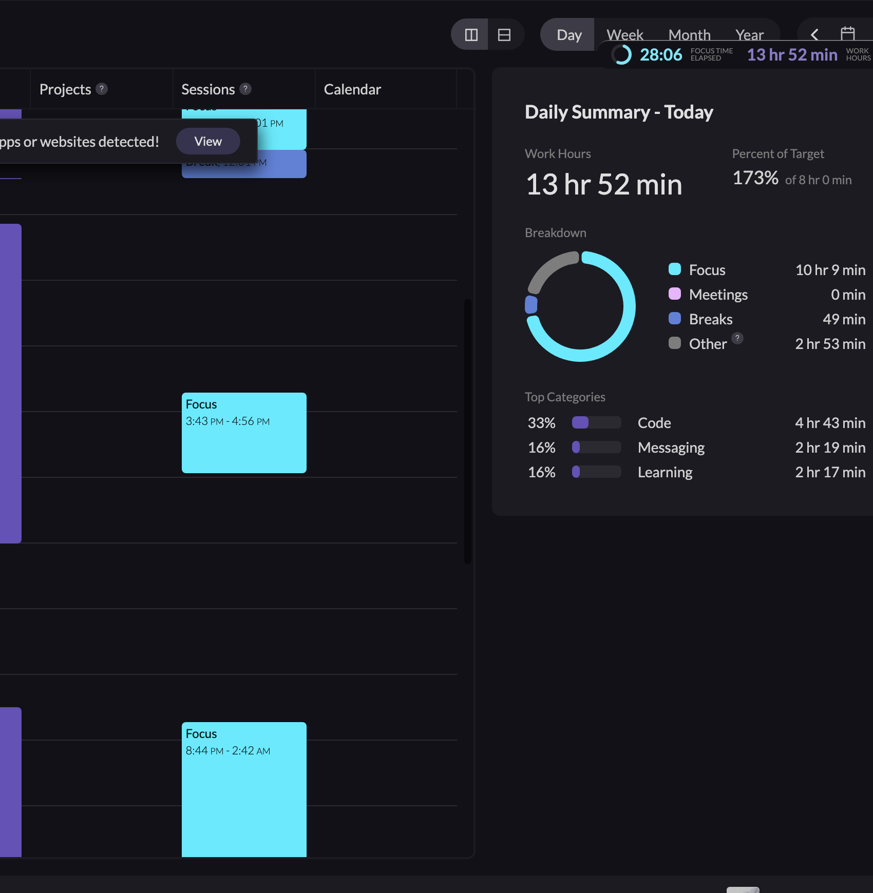

# TIL

## 날짜: 2024-06-19

### 스크럼

- 학습 목표 1 : 수업 실습 진행
- 학습 목표 2 : 사이드 플젝 헤더, 메인페이지 레이아웃 구현

### 오늘의 도전 과제와 해결 방법

- 도전 과제 1: aws - 아파치, 톰캣 실습
  
- 도전 과제 2: 사이드 플젝.. 첫 빌드 실패를 경험한 날
  
  문제 : 리액트 페이지에서 리턴이 안되는 코드가 문제였던 것 같다.

하단 코드를 전부 주석으로 해놨었음.

```javascript
// 코드예시.
// 검색어에 따른 동적 라우팅 페이지

import { useRouter } from "next/router";

export default function SearchResults() {
  const router = useRouter();
  const { query } = router.query;

  return <div></div>;
}
```

아직 구현이 덜된 코드여서 주석으로 가려놨다가 낭패를 봤었다.
고치는김에 font 설정도 next/font로 변경해주었다.



### 오늘의 회고

- 빌드 실패를 끝내 해결하고 잤다. 행복하다. 또 한번 성장했다
- 수업 추가과제를 완성하지 못해 아쉽다. 이것도 진행하고싶다.

### 블로그, 노션, 깃 정리 링크

- [feature/ 메인 페이지, 헤더 레이아웃 구현 #2](https://github.com/Murakano/murakano-fe/pull/2)
- [링크 제목](URL)

## 오늘의 공부시간 13h 37m


