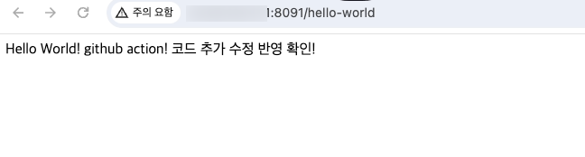

# TIL

## 날짜: 2024-06-28.md

### 스크럼

- 학습 목표 1 : CI/CD 딥다이브
- 학습 목표 2 : 깃허브 액션으로 CI/CD 구현하고 정리하기 - EC2, CodeDeploy, S3
- 학습 목표 3 : 알고리즘 공부

### 새로 배운 내용

- CI/CD 의 정확한 개념 정리
- 깃허브 액션 실제로 배포 자동화 구현해보면서 흐름 이해와 각종 오류 발생 해결
  결과 : 빌드/배포 자동화 성공 !
  
  

### 오늘의 도전 과제와 해결 방법

- 도전 과제 1: 도전 과제에 대한 설명 및 해결 방법
  Actions 탭에서 빌드가 성공해도, 배포에서는 오류가 생길 수 있다. 이럴 때는 AWS CodeDeploy - 배포 에 들어가면 로그 정보를 볼 수 있다.
  나는 이 오류로 많은 시간을 에러 파악에 소요했다.
  ( 에러로 인한 증상 : 터미널 창에서 ssh 접속 시 흰 창만 뜸, CodeDeploy 무한 진행 중 상태 )
  
  로그정보로 error가 있으면 해결가능하지만, 내 로그에는 error가 없었고, 하단 사진처럼 EC2에서 문제가 발생했다.
  인스턴스 연결성 검사 실패였는데,
  나는 인스턴스 리부트로 해결했다. : ec2 console -> 인스턴스 ->인스턴스 상태 -> 인스턴스 재시작
  재시작된 것 같아도 꽤 오랜시간이 지나야 반영된다. 알아서 상태검사 통과로 바뀌고 문제 해결 할 수 있었다.
- 도전 과제 2: 도전 과제에 대한 설명 및 해결 방법

### 오늘의 회고

- 매번 도전하고 싶었던 깃허브 액션을 구현해낸 날이라 뿌듯하다. 딥다이브 주제로 CI/CD 개념을 잡고, CI/CD를 구현해볼 수 있어서 더 공부가 많이 된 것 같다.
- 오류가 정말 시도때도 없이 나고 어려웠다. 딥다이브 옵션이 시연이라 하고싶은 욕심과 못해낼까봐 두려움이 공존했는데 결국 해내서 정말 뿌듯하다.
- 나중에 내가 또 깃허브액션을 구현하고 싶을떄. 오류없이 a to z 그대로 따라갈만한 자료를 못찾아서, 오늘 내가 진행한 순서와, 세부적인 사항까지 모두 기록해 블로그에 남겼다.

### 블로그, 노션, 깃 정리 링크

- [CI 와 CD가 무엇인지 딥다이브](https://goorm.notion.site/1-CI-CD-CI-CD-d711795302194baa89234d7c42472e10?pvs=4)
- [Github Action으로 SpringBoot 프로젝트 AWS EC2에 자동 빌드/배포하기 ( CI/CD 구현 실습 )](https://sen2y-it.tistory.com/53)

### 오늘의 공부시간 : 13h 30m

