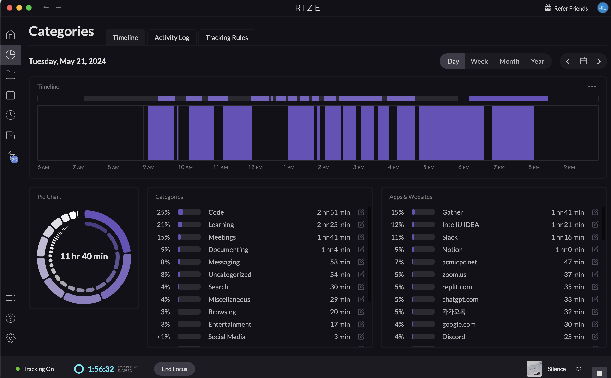

# TIL

## 날짜: 2024-05-21

### 스크럼

- 학습 목표 1 : 6주차 과제 진행

### 새로 배운 내용

# 해시 테이블 (Hash Table)이란?

해시를 알기 전에 일반적인 `직접 주소 테이블`과  `해시 테이블` 에 대해 먼저 알아보자.

## 직접 주소 테이블

해시 테이블의 아이디어는 직접 주소 테이블이라는 자료 구조에서 출발한다. 직접 주소 테이블은 입력받은 value가 곧 key가 되는 데이터 매핑 방식이다. 아래 코드 예시와 같이 **`key 값`에는 `숫자만 가능`하다.**

- 단점 : 공간의 효율성이 좋지 못하다.


## 해시 테이블

직접 주소 테이블의 공간 효율이 좋지 않다는 단점을 보완한 게 바로 해시 테이블이다. 해시 테이블은 직접 주소 테이블과 같이 값을 바로 테이블의 인덱스로 사용하는 것이 아니라 해시 함수라는 것에 한번 통과 시켜 사용한다.

<aside>
👉 바로 문자열로 받은 key 값을 해싱이라는 과정을 통해서, 일정 길이의 주소값으로 바꿔서 저장해두고 있기 때문에 이걸 가능하게끔 하는 역할이 `해시 함수`의 역할이다.

</aside>

이는 자료구조 종류 중 하나로 `key 와 value`를 가진다. 아래와 같은 자료구조를 말한다.

```jsx
직업: 개발자
나이: 23
전화번호: 010-xxxx-xxxx
이메일: xxxx@naver.com
```

이렇게 직업, 나이 같은 `key` 라는 값에 개발자, 23 같은 value를 저장해두는 방식이다.

원래 이러한 것과 비슷한 것이 우리가 자주 쓰는 배열에서도 쓰인다.

대신에 **배열과 차이점이라고 한다면 `key 값`이 `배열은 숫자만 가능`하다는 점이다.**

그렇다면 `해시 테이블`은? `숫자 뿐 아니라, 문자열도 key 값으로 가능`하다.

# JS에서 해시쓰는 방법

사실, JS에선 `일반 객체`에서 key 값에 문자열이 주는게 가능하다.

또한, JS에선 좀 더 쉽게 해시 테이블을 사용할 수 있게끔 해주는 자료구조가 있다. → `Map`

내부적으로 해시 테이블과 유사한 구조인 객체와, 해시 테이블을 사용하는 Map을 알아보도록 하자.

## 객체 Object

JavaScript 객체는 키-값 쌍을 저장하는 데 사용되며, `키는 문자열이나 심볼로 제한`된다.

내부적으로 객체는 해시 테이블과 유사한 구조를 사용하여 키-값 쌍을 저장하고 검색한다.

이는 키를 해싱하여 빠르게 값을 검색할 수 있게 한다.

<aside>
👉 **객체**: 키는 문자열 또는 심볼로 제한되며, 다른 타입의 키는 문자열로 변환된다. 값에는 모든 타입을 저장할 수 있다.

</aside>

```jsx
const obj = {};
obj["나이"] = 23;
obj["직업"] = "개발자";

console.log(obj["나이"]); // 23
console.log(obj["직업"]); // "개발자"
console.log(obj); // { 나이: 23, 직업: '개발자' }
```

## Map

`Map`은 key가 있는 데이터를 저장하는데 쓰이는 자료구조이다.

**`Map`**은 객체와 달리 `모든 타입의 키를 허용`하며, 키의 삽입 순서를 기억한다.

**`Map`**은 내부적으로 해시 테이블을 사용하여 키-값 쌍을 저장하고 검색한다.

**많은 삽입/삭제 작업**: **`Map`**은 많은 요소를 삽입하고 삭제하는 작업에서 더 일관된 성능을 제공한다.

이때 key 값은 문자열 또한 가능하다. 따라서 이를 가지고 hash에 이용할 수 있다.

<aside>
👉 키로 모든 타입을 허용하며, 값을 문자열로 변환하지 않는다. 원래의 타입을 유지한다.

</aside>

```jsx
const map = new Map();
map.set("나이", 23);
map.set("직업", "개발자");

console.log(map.get("나이")); // 23
console.log(map.get("직업")); // "개발자"
console.log(map); // Map(2) { '나이' => 23, '직업' => '개발자' }
```

### Map 성능과 메서드

- `Map` 성능

**`Map`**은 대량의 데이터에 대해 일관된 성능을 제공하도록 설계되었다. **`Map`**의 메서드(**`set()`**, **`get()`**, **`has()`**, **`delete()`**)는 평균적으로 O(1)의 시간 복잡도를 가지며, 특히 많은 요소를 삽입하고 삭제하는 작업에서 객체보다 성능이 우수하다.

- Map 함수 메서드 사용해보기

  ```jsx
  // 1. Map 객체 생성
  const map = new Map();

  // 2. map.set(key, value)
  // 키를 이용해 값을 저장합니다.
  map.set("name", "Alice");
  map.set("age", 25);
  map.set("job", "developer");

  // 3. map.get(key)
  // 키에 해당하는 값을 반환합니다.
  console.log(map.get("name")); // Alice
  console.log(map.get("age")); // 25

  // 4. map.has(key)
  // 키가 존재하는지 확인합니다.
  console.log(map.has("job")); // true
  console.log(map.has("salary")); // false

  // 5. map.delete(key)
  // 키에 해당하는 값을 삭제합니다.
  map.delete("age");
  console.log(map.has("age")); // false

  // 6. map.size
  // Map 객체의 요소 개수를 반환합니다.
  console.log(map.size); // 2

  // 7. map.forEach(callback)
  // Map의 모든 요소에 대해 반복 작업을 수행합니다.
  map.forEach((value, key) => {
    console.log(`${key}: ${value}`);
  });
  // Output:
  // name: Alice
  // job: developer
  ```

## 정리

<aside>
👉 `**객체**`는 단순한 데이터 구조를 다룰 때 적합하며, **`Map`**은 많은 데이터와 복잡한 키 타입을 다룰 때 더 나은 성능과 유연성을 제공한다. 따라서, 특정 상황에서 어떤 것을 사용할지 결정할 때는 이러한 차이점을 고려하는 것이 중요하다.

</aside>

### 오늘의 도전 과제와 해결 방법

- 도전 과제 1: 알고리즘 문제풀이
  1463, 11726, 11727, 10844, 12865, 1961

### 오늘의 회고

- 자바로 수업진도가 변경되면서부터 해당 과제를 하려고 하니 부쩍 무기력해지고 집중을 못하고 있다. 오늘은 너무 졸렸다.
- 컨디션 관리 잘하고. 정신차리자.

### 블로그, 노션, 깃 정리 링크

- [백준 DP 알고리즘 풀이](https://sen2y-portfolio.notion.site/6-c64c03b729804751ae3c4a65d2d94e53?pvs=4)
- [알고리즘 해싱 정리](https://goorm.notion.site/6-a42f8bade16048d286b17140f4b485a1?pvs=4)

공부시간 11h 40m

