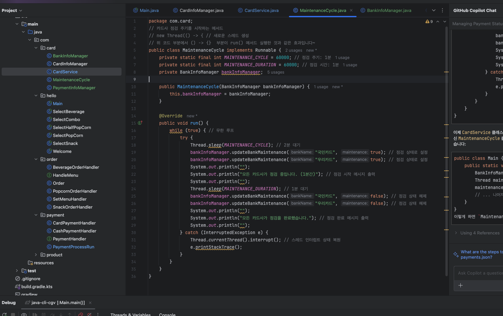
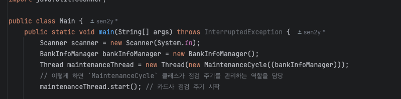
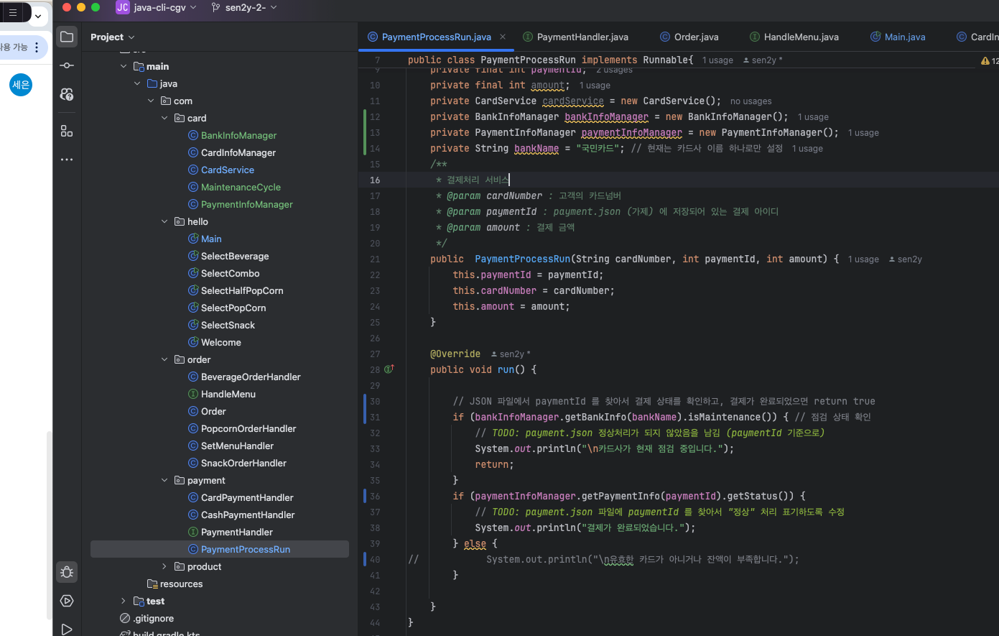
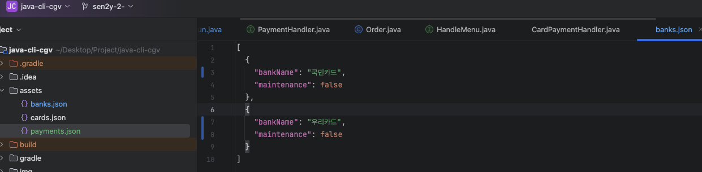
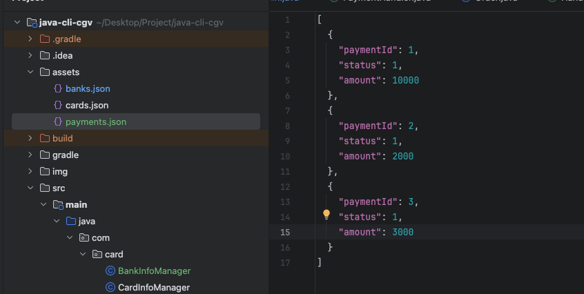

# TIL

## 날짜: 2024-05-27

### 스크럼

- 학습 목표 1 : 과제 7 진행 , 6주차 과제에서 비동기 로직 추가해보기

### 오늘의 도전 과제와 해결 방법

- 도전 과제 1: 비동기 로직 어떤것을 추가할까?

1. 은행 점검 스레드를 만들어서 메인 스레드가 시작될때부터 2분마다 1분씩 카드사가 점검에 들어가면, 카드 결제가 불가능하게 만든다.
1. 결제 스레드를 만들어 카드 승인 여부를 백그라운드에서 실행시킨다.
1. 결제 로직에서 시간초과는 매우 중요하다. 사용자가 10초이내 카드번호를 입력하지 않으면 결제수단 선택 창으로 다시 돌려보낸다.
1. 클래스 내 변수에 의존성을 만들지 말고, JSON에서 값을 직접 변경시키고 가져와서 프로그램 실행에 엉키지 않고 독립적으로 데이터를 관리할 수 있도록 한다.

- 도전 과제 2: 스레드 생성 후 10초뒤 스레드를 강제 종료시킬때,
  스레드를 강제 종료시키면서 문제점이 발생했다.
  
  
  
  
  

### 오늘의 회고

- 너무 어렵고 이론으로만 공부 + 코드위주로 일단 해결해나가보려고 하니 문제가 계속 발생한다. 어떻게 코드가 굴러가는지 이해가 없어 문제가 발생하기도했다. 질의응답을 통해 JSON을 활용하여 코드 간 의존성을 줄이고 JSON 값을 업데이트하고 가져오는 방식으로 데이터가 꼬이지 않도록 바꾸는 방식을 채택하였다.

### 블로그, 노션, 깃 정리 링크
